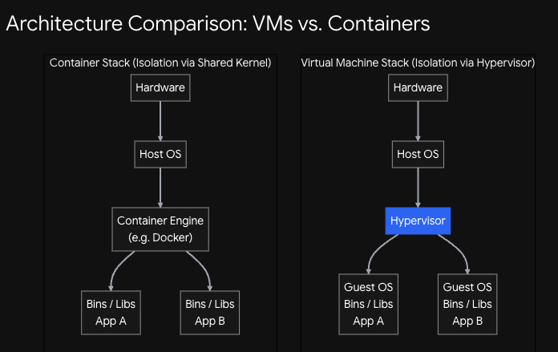
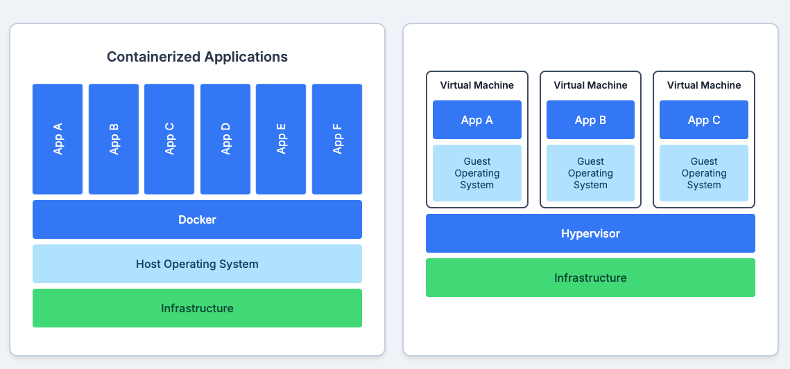

# Containers Practice Guide — i310202
> Linux primitives that make containers work  
> **Run everything on Ubuntu Linux directly**  
> Scripts are in: `container-demos/demo-0*.sh`

## Virtual Machines vs Containers



## Setup — Your Linux Environment

All demos run directly on your Ubuntu Linux system as a **non-root user with sudo**.

```bash
# Install all tools needed for the demos
sudo apt-get update && sudo apt-get install -y \
  procps \
  iproute2 \
  util-linux \
  libcap2-bin \
  pax-utils \
  tree \
  pv

# Clone the training repo
git clone https://github.com/sriramrokkam/k8s-training.git
cd k8s-training/container-demos
```

> **Two terminals tip:** open a second terminal side-by-side — useful for running  
> `top` or comparing before/after output while a demo runs.

> **All scripts refuse to run as root.** Always run as your normal user account.  
> The scripts use `sudo` internally for operations that need it (mount, chroot, etc.).

---

## The Big Picture — What Are We Building Up To?

Each demo adds one more layer of isolation. Run them in order.

```
demo-01  chroot        →  isolates the FILESYSTEM
demo-02  namespaces    →  isolates PROCESSES, USERS, HOSTNAME
demo-03  cgroups       →  limits RESOURCES (CPU, memory)
demo-04  capabilities  →  restricts ROOT PRIVILEGES
demo-05  seccomp       →  filters SYSTEM CALLS
demo-06  overlayfs     →  layered READ-ONLY image + thin WRITE layer
demo-07  bind-mount    →  maps HOST directories into a container path

A real container = all of these working together.
```

---

## Demo 01 — chroot: Isolating the Filesystem Root

### Concept
`chroot` changes what a process sees as `/` (the root).  
The process cannot see or access anything above its new root — it is trapped.  
This is the foundation of container images: **the image is just a directory tree** that becomes the root for the container process.

### BEFORE — record the baseline
```bash
# How much of the filesystem can we see?
ls /
# expected: bin  boot  dev  etc  home  lib  lib64  media  mnt  opt proc  root  run  sbin  srv  sys  tmp  usr  var
# 20+ directories = the full system

# What PID are we?
echo $$
# expected: some high number like 4523

# Can we see all processes?
ps -ef | wc -l
# expected: many processes
```

### Run the script
```bash
cd ~/k8s-training/container-demos
bash demo-01-chroot.sh
```

### WHAT THE SCRIPT DOES (step by step)
1. Creates `~/container101/` — this becomes the fake root
2. Copies `/bin/bash`, `/bin/ls`, `/bin/ps` and their shared libraries into it
3. Mounts `/proc` inside it so `ps` can work
4. Runs `chroot . /bin/bash` — you are now inside the isolated filesystem

### AFTER — what to observe inside the chroot
```bash
# How much of the filesystem can we see now?
ls /
# expected: bin  lib  proc  only (no /etc /home /usr /var)

# Can we escape?
cd ../../..
ls /
# expected: still just bin  lib  proc — cannot break out

# Can we go to /etc?
cd /etc
# expected: bash: cd: /etc: No such file or directory

# Are processes isolated?
ps -ef
# expected: shows ALL processes from the full system — NOT isolated
echo $$
# expected: same high PID as before chroot, NOT 1
```

### What to explain
```
chroot DOES:   ✅ isolate the filesystem root  (container sees only its own files)
chroot DOES NOT: ❌ isolate processes  (ps shows everything)
               ❌ isolate network
               ❌ isolate users

→ The "I have no name!" prompt you see inside is expected —
  there is no /etc/passwd in the chroot, so the shell can't resolve the username.
  This is exactly what a container image without passwd looks like.

→ A container image is NOT a full OS.
  It is a directory tree (bins + libs) your process is chrooted into.
  The kernel is always the HOST kernel — the image just provides userland.
```

---

## Demo 02 — Namespaces: Isolating What a Process Can See

### Concept
Linux namespaces make a process think it is alone.  
chroot only isolated the filesystem — namespaces complete the picture by isolating processes, users, hostname, network and more.

| Namespace | Isolates |
|-----------|---------|
| **USER**  | User and group IDs — fake root that isn't really root |
| **PID**   | Process tree — container thinks it is PID 1 |
| **UTS**   | Hostname and domain name |
| **NET**   | Network interfaces, routing, ports |
| **MNT**   | Filesystem mounts |
| **IPC**   | Inter-process communication |

### BEFORE — record the baseline
```bash
# What user are we?
whoami
id -u
# expected: your username, UID like 1000  (non-zero = not root)

# What namespaces does our process belong to?
ls -al /proc/self/ns
# note the numbers next to each namespace file
# e.g.  user:[4026531837]   pid:[4026531836]
# Write down the user namespace number — you will see it change

# What is the UID mapping in our namespace?
cat /proc/self/uid_map
# expected: 0  0  4294967295
# meaning: UID 0 maps to UID 0, linearly, for all UIDs

# What is our hostname?
hostname
# expected: your machine's real hostname

# How many processes can we see?
ps -ef | wc -l
```

### Run the script
```bash
bash demo-02-unshare.sh
```

### WHAT THE SCRIPT DOES
**Part 1 — USER namespace:**  
Creates a new user namespace with `unshare --map-root-user --user`, mapping your UID to root (UID 0) inside the namespace.

**Part 2 — PID namespace:**  
Creates a new PID namespace with `sudo unshare --pid --fork --mount-proc`, where the new bash process becomes PID 1.

### AFTER — what to observe

**Inside the USER namespace:**
```bash
whoami
id -u
# expected: root / 0  (we appear to be root!)

# But can we actually do root things?
rm -f /boot/vmlinuz-*
# expected: Operation not permitted  (fake root, cannot touch real system files)

cat /etc/shadow
# expected: Permission denied  (still no real privileges)

# Check the namespace number — it changed!
ls -al /proc/self/ns
cat /proc/self/uid_map
# expected: 0  <your-real-uid>  1
# UID 0 inside = your real UID outside — it is a remapping, not real root
```

**Inside the PID namespace:**
```bash
ps -ef
# expected: only 2 processes (bash + ps) — fully isolated
echo $$
# expected: 1  (this process IS PID 1)
ls -al /proc/self/ns/pid
# expected: inode number is DIFFERENT from what you recorded before
```

### What to explain
```
USER namespace:  You LOOK like root inside, but it's a remapped UID.
                 Real kernel operations are still blocked.
                 → This is how rootless containers work.

PID namespace:   Your process thinks it is PID 1 (the init process).
                 It cannot see any other processes.
                 → This is why "ps" inside a container shows only 1-2 processes.

Combined with chroot from demo-01:
  chroot     = can't see other files
  namespaces = can't see other processes / users / hostname
  Together they create the isolation illusion a container needs.
```

---

## Demo 03 — cgroups: Limiting What a Process Can Use

### Concept
Control Groups (cgroups) set hard resource limits on processes.  
Without cgroups, one process could consume 100% CPU or all RAM and starve everything else.  
This is how `docker run --memory 128m --cpus 0.5` is enforced — not by Docker, but by the Linux kernel.

### BEFORE — open a second terminal and run `top`
```bash
# Terminal 2:
top
# Keep this running — you will watch CPU% change live during the demo
```

```bash
# Terminal 1 — note the current state
# cgroups are managed through the /sys filesystem
ls -la /sys/fs/cgroup
# → lots of entries: cpu, memory, io, pids etc. — each is a controllable resource

# Start a CPU-burning process manually to see unthrottled behaviour
dd if=/dev/zero of=/dev/null bs=1M &
# → in top (Terminal 2): this dd takes ~100% of one CPU core
kill %1
```

### Run the script
```bash
bash demo-03-cgroup_v2.sh
# When prompted, confirm you have 'top' running in a second terminal
```

### WHAT THE SCRIPT DOES
1. Starts **3 `dd` processes** burning CPU — watch all three in `top` sharing ~33% each
2. Creates a new cgroup: `mkdir /sys/fs/cgroup/mydemocpugroup`
3. Moves **2 of the 3** `dd` processes into the cgroup
4. Sets `cpu.max = "50000 100000"` → 50% CPU max for the whole group
5. Kills all dd processes at the end

### AFTER — what to observe in `top`
```
BEFORE cgroup:
  dd #1  ~33% CPU
  dd #2  ~33% CPU   ← these two will be put in the cgroup
  dd #3  ~33% CPU

AFTER cpu.max = 50000/100000 (50% limit):
  dd #1  ~25% CPU  ←─┐ both share 50% total
  dd #2  ~25% CPU  ←─┘ throttled by kernel
  dd #3  ~50% CPU     ← free, no cgroup limit
```

```bash
# Also observe how the cgroup directory self-populates
ls -al /sys/fs/cgroup/mydemocpugroup
# → cpu.max  cgroup.procs  memory.max  io.max  ...
# → created automatically by kernel — no config files needed

cat /sys/fs/cgroup/mydemocpugroup/cpu.max
# → 50000 100000   ← 50ms out of every 100ms period = 50% CPU
```

### What to explain
```
The cgroup is just a directory in /sys/fs/cgroup.
The kernel populates it with control files automatically.
Writing a PID to cgroup.procs puts that process under the cgroup's rules.
Writing to cpu.max changes the limit instantly — no restart needed.

→ This is how "docker run --cpus 0.5" works:
  Docker creates a cgroup directory and writes 50000 100000 into cpu.max.
  The kernel does the actual throttling — Docker is just the orchestrator.

→ OOMKilled in Kubernetes?
  That is the kernel's memory cgroup killing a process
  that exceeded its memory.max limit.
```

---

## Demo 04 — Capabilities: Fine-grained Root Privileges

> **Note:** This demo requires Docker to be installed and running.  
> It shows capabilities by running containers with and without specific capabilities.

### Concept
Linux breaks the traditional "root can do everything" model into ~40 individual capabilities.  
Even if a process runs as root (UID 0) inside a container, it only has the capabilities  
explicitly granted to it. Everything else is blocked.

### BEFORE — see all capabilities on your system
```bash
# Your current process as a normal user
cat /proc/self/status | grep CapEff
# expected: CapEff: 0000000000000000  (no effective capabilities)

# Decode what capabilities a value means
capsh --decode=0000003fffffffff
# expected: shows the full list including cap_chown, cap_net_admin, cap_sys_admin

# Try to change hostname
hostname newname
# expected: you must be root to change the host name
```

### Run the script
```bash
bash demo-04-capabilities.sh
```

### WHAT THE SCRIPT DOES
1. Builds a small Docker image with the demo scripts inside it
2. **Container 1** — runs with Docker's default (reduced) capability set:  
   tries `hostname kuala-lumpur` → **fails** even though `whoami` shows root
3. **Container 2** — runs with `--cap-add SYS_ADMIN` explicitly added:  
   tries `hostname kuala-lumpur` → **succeeds**

### AFTER — what to observe
```bash
# Inside Container 1 (default capabilities):
whoami           # → root
id -u            # → 0
hostname kuala-lumpur
# → hostname: you must be root to change the host name ← blocked! ❌
# Why? Docker removes CAP_SYS_ADMIN from the default set.

# Inside Container 2 (--cap-add SYS_ADMIN):
hostname kuala-lumpur
# → (no error — it worked) ✅
hostname
# → kuala-lumpur
```

### What to explain
```
Traditional Linux:  root = god. Can do everything.
Linux capabilities: root is split into ~40 fine-grained permissions.

Docker default container drops:
  ❌ CAP_SYS_ADMIN    (no hostname, mount, etc.)
  ❌ CAP_NET_ADMIN    (no adding network interfaces)
  ❌ CAP_SYS_MODULE   (no loading kernel modules)
  ❌ CAP_SYS_TIME     (no changing system clock)
  ... and more

Docker keeps:
  ✅ CAP_CHOWN        (can change file ownership)
  ✅ CAP_NET_BIND_SERVICE  (can bind to ports < 1024)
  ✅ CAP_KILL         (can kill own processes)

→ Running as root inside a container is NOT the same as root on the host.
→ "I am root" inside a container is a limited, caged root.
→ --privileged removes ALL restrictions — never use in production.
```

---

## Demo 05 — seccomp: Filtering System Calls

> **Note:** This demo requires Docker and the Go programming language installed.

### Concept
Every operation a program does (read a file, open a socket, fork a process) goes through  
a **system call** to the kernel. seccomp (Secure Computing) is a kernel filter that can  
block specific syscalls entirely — before they even reach the kernel.  
Docker applies a default seccomp profile blocking ~44 dangerous syscalls.

### BEFORE — see that syscalls are unrestricted normally
```bash
# strace shows every syscall a process makes
strace -c ls /tmp
# expected: shows read, write, openat, getdents64 etc. all succeed

# Check if seccomp is active on your process
cat /proc/self/status | grep Seccomp
# expected: Seccomp: 0   (0 = no filter, 2 = filter active)
```

### Run the script
```bash
bash demo-05-seccomp.sh
```

### WHAT THE SCRIPT DOES
1. Compiles a tiny Go program that calls `uname()` syscall
2. Runs it **without** seccomp — works normally
3. Runs it **with** a seccomp profile that **blocks** `uname` — process is killed
4. Shows how to inspect a seccomp profile JSON

### AFTER — what to observe
```bash
# Without seccomp profile:
# → program runs and prints kernel info normally

# With seccomp profile blocking uname:
# → process killed with "Bad system call" or exit code 159
# → the syscall never reached the kernel — blocked at entry

# Inside the container:
cat /proc/self/status | grep Seccomp
# → Seccomp: 2   ← filter is active
```

### What to explain
```
Capabilities say: "you can't do network admin operations"
seccomp says:     "you can't even CALL the syscall to try"

It's a second, deeper layer of defence:
  1. Capabilities block high-level privileges
  2. seccomp blocks the raw kernel interface

Docker's default seccomp profile blocks syscalls like:
  ❌ keyctl      (kernel keyring — privilege escalation vector)
  ❌ ptrace      (process tracing — could inspect other processes)
  ❌ reboot      (would reboot the host)
  ❌ kexec_load  (load a new kernel)

→ Even if someone bypasses capabilities, they still hit the seccomp wall.
→ --security-opt seccomp=unconfined removes this wall — avoid in production.
```

---

## Demo 06 — OverlayFS: Layered Container Filesystems

### Concept
Container images are built in layers (each Dockerfile instruction = one layer).  
OverlayFS stacks multiple **read-only** directories and adds a **single writable** layer on top.  
When you write a file, it goes into the RW layer — the image layers are never modified.  
When you delete a file from a lower layer, a special "whiteout" marker is created in the RW layer.

```
RW layer  ← your writes go here (lost when container is deleted)
─────────
ro3       ← layer 3 (e.g. COPY app.jar)
ro2       ← layer 2 (e.g. RUN apt-get install java)
ro1       ← layer 1 (e.g. FROM ubuntu:22.04)
```

### BEFORE — three separate directories, no connection
```bash
# The script creates this structure:
#   ~/overlay/ro1/  → contains file: bayern
#   ~/overlay/ro2/  → contains file: muenchen
#   ~/overlay/ro3/  → contains file: beckenbauer
#   ~/overlay/rw/   → empty (will become the writable layer)
#   ~/overlay/work/ → empty (required by overlayfs internals)
#   ~/overlay/merged/ → the mountpoint where everything comes together

# Before mounting, each directory is completely separate:
ls ~/overlay/ro1   # → bayern
ls ~/overlay/ro2   # → muenchen
ls ~/overlay/ro3   # → beckenbauer
ls ~/overlay/rw    # → (empty)
ls ~/overlay/merged # → (empty)
```

### Run the script
```bash
bash demo-06-overlayfs.sh
```

### WHAT THE SCRIPT DOES
1. Creates the 3 read-only dirs with one file each
2. Mounts them as an overlay: `mount -t overlay overlay -o lowerdir=ro3:ro2:ro1,upperdir=rw,workdir=work merged`
3. Shows `merged/` — all 3 files visible together
4. Creates a new file in `merged/` (hoeness)
5. Deletes a file from `merged/` (beckenbauer)
6. Unmounts and inspects what happened to the lower layers

### AFTER — what to observe
```bash
# Immediately after mount — merged shows ALL files:
ls merged/
# → bayern  beckenbauer  muenchen   ← all 3 lower layers unified ✅

# After touch merged/hoeness and rm merged/beckenbauer:
ls merged/
# → bayern  hoeness  muenchen   ← beckenbauer gone, hoeness added

# After unmount — check what happened under the hood:
ls ro3/
# → beckenbauer   ← STILL THERE in the lower layer, untouched ✅
# (lower layers are read-only — the delete never touched ro3)

ls rw/
# → hoeness              ← new file went to the RW layer ✅
# → beckenbauer          ← a character device (whiteout file)!
# The whiteout file is OverlayFS's way of "hiding" a file from a lower layer
```

### What to explain
```
This is EXACTLY how Docker images work:

FROM ubuntu     → ro1 (base layer, read-only)
RUN apt install → ro2 (new layer on top, read-only)
COPY app.jar    → ro3 (new layer on top, read-only)
[container runs] → rw (your writes, deleted on docker rm)

Key observations:
  1. All image layers are SHARED between containers.
     100 containers using the same nginx image = 100 x rw layers,
     but only 1 copy of the nginx image layers on disk.

  2. Deleting a file does NOT remove it from the lower layer.
     It creates a whiteout marker. The image size grows when you delete.
     This is why "RUN apt-get install && apt-get clean" must be ONE layer.

  3. Container writes are LOST when the container is deleted.
     Only the image layers (lower, read-only) survive docker rm.
     → Use volumes for persistent data.
```

---

## Demo 07 — Bind Mount: Injecting Host Files into a Container Path

### Concept
A bind mount makes a directory from one location on the filesystem appear at another location.  
The original content at the target is hidden while the mount is active.  
Writes at either end are immediately visible at the other — they point to the same disk location.  
This is how `docker run -v /host/path:/container/path` works.

### BEFORE — two separate directories
```bash
# The script creates:
#   ~/bind/a/  → contains file: sap
#   ~/bind/b/  → contains file: walldorf

ls ~/bind/a    # → sap
ls ~/bind/b    # → walldorf
# They are completely independent at this point
```

### Run the script
```bash
bash demo-07-bind-mount.sh
```

### WHAT THE SCRIPT DOES
1. Creates `a/` (with file `sap`) and `b/` (with file `walldorf`)
2. Bind-mounts `a` onto `b`: `mount -o bind a b`
3. Shows what `b/` contains now
4. Creates a file inside `b/` (st-leon-rot)
5. Unmounts `b`
6. Shows what survived in both directories

### AFTER — what to observe
```bash
# Immediately after bind mount:
ls b/
# → sap      ← b now shows a's content!
# → walldorf IS GONE — hidden behind the mount (not deleted)

# After touch b/st-leon-rot (write while mounted):
ls b/
# → sap  st-leon-rot

ls a/
# → sap  st-leon-rot   ← file appears in a too! Same disk location ✅

# After unmount:
ls b/
# → walldorf   ← original content of b is back ✅ (was never deleted)

ls a/
# → sap  st-leon-rot   ← file written during mount stays in a ✅
```

### What to explain
```
Bind mount = re-mapping a path, not copying.

This is exactly docker run -v /myapp:/app:
  /myapp on HOST  →  mounted at /app inside container
  Container writes to /app  →  instantly visible in /myapp on host
  Container is deleted      →  /myapp on host still has the files ✅

Practical uses in containers:
  ├── Inject config files without rebuilding the image
  ├── Persist database files (postgres data directory)
  ├── Share source code during development (live reload)
  └── Inject secrets from host into container

Security risk:
  mount -o bind /etc /container/etc  →  container can read /etc/shadow
  Always use ,readonly for config mounts:
  docker run -v /config:/app/config:ro ...
```

---

## Quick Reference — Demos at a Glance

| Demo | Script | Concept | Key command to observe |
|------|--------|---------|----------------------|
| 01 | demo-01-chroot.sh | Filesystem isolation | `ls /` inside chroot — only 3 dirs |
| 02 | demo-02-unshare.sh | Process & user isolation | `ps -ef` = 2 processes; `echo $$` = 1 |
| 03 | demo-03-cgroup_v2.sh | Resource limits | `top` — CPU drops from 33% to 25% per dd |
| 04 | demo-04-capabilities.sh | Privilege slicing | `hostname` fails inside container (needs Docker) |
| 05 | demo-05-seccomp.sh | Syscall filtering | Program killed with "Bad system call" (needs Docker + Go) |
| 06 | demo-06-overlayfs.sh | Layered filesystem | `ls rw/` shows whiteout file for deleted item |
| 07 | demo-07-bind-mount.sh | Host path injection | Write in `b/` appears in `a/` immediately |

---

## Learning Path

- [ ] `01` chroot — filesystem root = just a directory  
- [ ] `02` namespaces — isolate PIDs, users, hostname  
- [ ] `03` cgroups — enforce CPU/memory limits  
- [ ] `04` capabilities — caged root (requires Docker)  
- [ ] `05` seccomp — block dangerous syscalls (requires Docker + Go)  
- [ ] `06` overlayfs — layered images, copy-on-write, whiteout  
- [ ] `07` bind-mount — host path → container path, live sync

