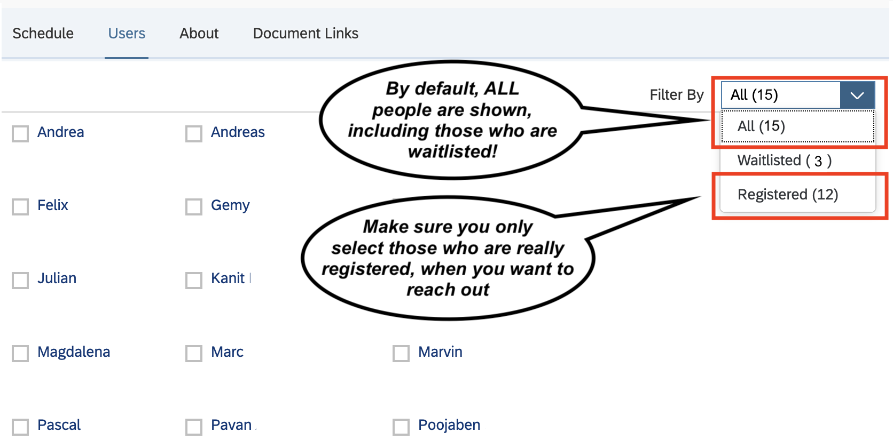

# Trainer Guide

## Overview

### Course Prep steps

These are the logical steps for a trainer to prep for a course (details below):

- Make sure your training is 'officially' requested and scheduled in SuccessMap Learning
- Sent an email with preparation steps to participants
- Request/create a Gardener cluster for your training
- Obtain/Download your trainer `kubeconfig` from Gardener that lets you control the cluster
- Logon to the training-admin server and prepare the cluster according to [this guide](https://github.wdf.sap.corp/D044431/training-admin#usage) (VPN required).

All artifacts / scripts / info needed as trainer is in this admin folder.
You can use the participant VM also for all work as a trainer.

## Course preparation

### K8s cluster in Gardener

- **Contact the [K8s Trainings DevOps Team](mailto:DL_5B2CDDFFECB21162D9000010@global.corp.sap?subject=[Docker%20and%20K8s%20fundamentals%20training]%20Request%20for%20trainings%20cluster%20-%20<Location>-<DateOfYourTraining>) to get a Gardener K8s Cluster** for the training (~ 2 weeks in advance to the training), in case you want to use the central resources in [Gardener](https://gardener.cloud.sap).

In the email body please refer to the corresponding event by attaching a SuccessMap screenshot. Go to `My Classes` and take a screenshot of the respective session in the `Scheduled Classes` section. It not only helps us to link the events properly, but we can size the cluster according to the number of registered participants.

### Create your trainer .kube/config to access the cluster

On your VM / machine:

- Create a directory `.kube` under `$HOME` (e.g. /home/vagrant on VM) and cd into it.
- Create new file `config` and paste the kubeconfig yaml, you have got from the [K8s Trainings DevOps Team](mailto:DL_5B2CDDFFECB21162D9000010@global.corp.sap?subject=[Docker%20and%20K8s%20fundamentals%20training]%20Request%20for%20trainings%20cluster%20-%20<DateOfYourTraining>) for your training.
- run `kubectl get nodes` - this command must complete by giving you a short list of nodes in the cluster

### Generate the kube configs for the participants and prepare the cluster

**Please note, that the process has changed significantly. Please read this section carefully!** :clipboard:

Instead of running things locally, we wrote a small webserver that runs within a Gardener Shoot Cluster on Converged Cloud.
In a nutshell, the server replaces `kubecfggen.sh` as well as the process of storing, uploading and sharing the results via Jenkins.

To access the "admin server", you need to connect to the office network (via VPN when working remotely):

<https://admin.ingress.trn-admin.k8s-trainings.c.eu-de-2.cloud.sap> with username=`admin` and password=`ov9u4Z/#vc[3JuI`

Start preparing a cluster by following the steps outlined [here](https://github.wdf.sap.corp/D044431/training-admin#usage).

**Make sure to note down the training name/id as well as the URL and password displayed at the end of the process. It is displayed only ONCE.**

Those information will be needed by the participants during the training. In case you missed or lost these information, please contact [K8s Trainings DevOps Team](mailto:DL_5B2CDDFFECB21162D9000010@global.corp.sap) for recovery.

**Please note:** The process creates not only the namespaces. It also deploys a ResourceQuota & LimitRange to each namespace. With this, abuse of the training cluster should become harder. The ResourceQuota limits the number of pods accepted by each namespace to 15. Any participant trying to scale a deployment to a hundred pods or more will not harm other participants. The LimitRange assigns default values for memory and CPU requested by a pod. It also give a default limit. If a pod does not specify any of these it will inherit the defaults. In other terms, by specifying a cpu/memory request & limit, the defaults can be overwritten.

**Please also note:** Participant-kubeconfigs will be deleted automatically 3 weeks after they have been created.

## Sending the preparation mail to participants

You should send a **'preparation mail'** to all participants about a week before the course starts. You should add the below information in your mail:

```text
------- adapt & add this info
- Please follow these instructions to download a VM and prep for the course:
  <link to repo>/blob/master/preparation.md
---------- end -----------
```

Also it is recommended to refer to the cheat-sheets for [docker](../docker/Docker%20Cheat%20Sheet.docx) and [Kubernetes](../kubernetes/cheat%20sheet.docx). Ask participants to print and bring them along, if they deem it would be helpful.

An other option would be to take one of our **mail template** we have prepared: [Template](./preparation_email_sample.md),

**Hint:** If you want get a list of the course participants, as the _main trainer_ you can

- Go to [SuccessMap Learning](https://sap.plateau.com/learning/user/deeplink_redirect.jsp?linkId=HOME_PAGE&fromSF=Y)
- There should be a tab "My Classes" (if not, likely you are not the _main_ trainer), click on it
- Then, find your training entry and check the "Users" tab
- **IMPORTANT:** make sure you filter only for the people who are registered, by default, also the waitlisted people are included
    

## Setting you up for the training

**Important: Forking is no longer necessary! But feel free to do so, if you feel more comfortable with it.**

### Clone the repo

There are demo scripts/files for the container, docker and kubernetes parts. Simply clone the repo to your VM and work with this copy:

`git clone https://github.tools.sap/kubernetes/docker-k8s-training.git`

We are referencing stable versions of our repo with a release tag, so you can use one of these for the training as well.

### Get the cluster and project name

You will need the information to setup components like the registry. It is also required for some docker exercises and k8s demos.

Look into your (trainer) kubeconfig. The file contains a URL for the API server of the cluster. You can derive the cluster as well as the project name from this URL.

The URL pattern on Gardener looks like this:

 `[custom-endpoint].ingress.<cluster-name>.<project-name>.shoot.canary.k8s-hana.ondemand.com`

**Example:** If your API server URL were `https://api.ccdev.k8s-train.shoot.canary.k8s-hana.ondemand.com`, the project name would be `k8s-train` and the cluster name would be `ccdev`.

### Adapt the ingress URLs

An ingress controller needs to be installed to each cluster and allows you to register custom URLs to a specific subdomain. Since the subdomain contains the name of the Gardener project as well as the cluster, you have to adapt the ingress resources locally (on your VM) to match with your setup.

Check the following files for `<cluster-name>` and `<project-name>` placeholders and replace them with the actual cluster/project name. You can use the following command to do so:

```bash
# Make sure you can access the cluster with kubectl before running the script, otherwise the script will fail
./replace_ingress_urls.sh
```

Alernatively, you can also replace the URLs manually by searching for the following patterns in the respective files and replacing them with the correct values:

- [simple ingress with tls demo](../kubernetes/demo/08a_tls_ingress.yaml.template?plain=1#L67) (2 places)
- [fanout & virtual host ingress demo](../kubernetes/demo/08b_fanout_and_virtual_host_ingress.yaml.template?plain=1#L146) (3 places)
- Image pull secret demo
  - [deployment with image secret](../kubernetes/demo/12c_deployment_with_image_secret.yaml.template?plain=1#L25)
  - [image pull secret](../kubernetes/demo/12d_image_pull_secret.yaml.template?plain=1#L6)
- [sample-app ingress](../sample-app/solutions/app-ingress.yaml.template?plain=1#L13) (2 places)
- [image pull secret](../sample-app/solutions/image-pull-secret.yaml.template?plain=1#L6)

### Setup helm

To continue with the setup, you need `helm`. If you do not have it installed already, follow the instructions here: <https://helm.sh/docs/intro/install/>

### Setup a docker registry (~1 day before course starts)

For the docker exercises you need a private docker registry. Participants will upload their custom images to it during the course. After using a plain docker registry for quite some time, we decided to switch to [Harbor](https://goharbor.io/). It comes with a UI and some more useful features.
In the admin folder of this repo, you find a registry folder with `install_harbor_registry.sh` script. Check the prerequisites and run the script as described [here](./registry/readme.md) to deploy a registry and make it available via an ingress.

### Build and push sample app artefacts

For some excercice / demos, you'll need to build and push some images to the registry. To do so, simply run all the `.sh` files in the [exercice_prep](./exercise_prep/) folder. This should push the images to the harbor registry created earlier, so please make sure it's up and running beforehand.

You'll also have to edit the final image URL in various files

- [sample-app deployment](../sample-app/solutions/app-deployment.yaml?plain=1#L25)
- [kube terminator helm chart](../kubernetes/demo/demo-chart/chart/values.yaml?plain=1#L2)

## During the Course

### Assign participants to namespace numbers

Feel free to use any suitable method to assign namespace numbers to participants and hand out the URL to download the kubeconfigs as well as training name and password to logon.

### Use the "master" kube.config

For all demos to work properly (especially the RBAC demo), you have to use an "admin" user when talking to the cluster. When you use the `kube.config` you got along with the cluster details, you are on the save side. However if you use a participant user / namespace, the RBAC demo will fail due to missing authorization.

Of course, you can create a separate namespace (!= `default`) and add it to the `kube.config` context definition to send requests to it by default.

### Add nodes to K8s cluster

In exceptional cases it might happen that your cluster needs more resources to deal with all the participants pods because autoscaler configuration is not sufficient high. In order to scale the cluster up, get in contact with the [K8s Trainings DevOps Team](mailto:DL_5B2CDDFFECB21162D9000010@global.corp.sap?subject=[Docker%20and%20K8s%20fundamentals%20training]%20Request%20for%20trainings%20cluster%20-%20<DateOfYourTraining>).

## After the course

- Contact the [K8s Trainings DevOps Team](mailto:DL_5B2CDDFFECB21162D9000010@global.corp.sap?subject=[Docker%20and%20K8s%20fundamentals%20training]%20Request%20for%20trainings%20cluster%20-%20<DateOfYourTraining>) to let destroy the Gardener cluster, you used for the training. If needed you can request to keep the cluster for one additional week, so participants can rework on their exercises.
- If you ask for one additional week please run [Cleanup Script](cluster_cleanup.sh) `cluster_cleanup.sh all` after the last day of training on the trainings cluster to help us save some money. In all but kube-system and logging namespace it
  - scales statefulsets and deployments down to one replica
  - removes unused pvcs
  - demotes LoadBalancer Services to NodePorts
