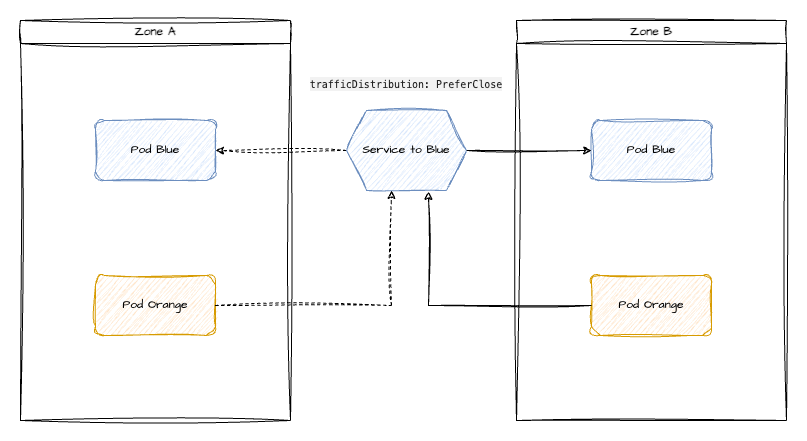

# Echo Server

`echo-server` is a minimal webserver printing the source IP of any incoming request to both, its HTTP response and its stdout.

It can be used to show how service routing within Kubernetes works.

## Build & Push

Build an image and

- specify the target platform used within the training K8s cluster
- tag the image
- upload it

```shell
# optional login; pwd can be found in trainer instructions for the registry
docker login h.ingress.<cluster-name>.k8s-train.shoot.canary.k8s-hana.ondemand.com -u participant
# build and push
docker build --platform linux/amd64 -t h.ingress.<cluster-name>.k8s-train.shoot.canary.k8s-hana.ondemand.com/training/echo-server:v1 --push .
```

## Deploy

If not yet done, create an image-pull secret in your namespace:

```shell
kubectl create secret docker-registry training-registry --docker-server=h.ingress.<cluster-name>.k8s-train.shoot.canary.k8s-hana.ondemand.com --docker-username=participant --docker-password='<todo>'
```

Update the [deployment](./manifests/deplyoment.yaml) to use the correct `image` and deploy it (`kubectl apply -f ./manifests/deployment.yaml`). Finally, create the service (`kubectl apply -f ./manifests/service.yaml`).

## Demo - step by step

### Show the initial setup

- Show the deployment, service and pods
- Wait for the LoadBalancers IP to be provisioned
- Show the service in detail (`kubectl get service echo-server -oyaml`)
- Show the `nodePort` and explain there is a target pool / group on infra level. Traffic coming in through the LB will be forwarded to the target pool's members on the `nodePort`.

### externalTrafficPolicy: Cluster

By default, services are created with `externalTrafficPolicy: Cluster`. This means, all nodes of the cluster are eligible to receive traffic coming from a LoadBalancer.
On infrastructure level, the LB's target pool contains all nodes and distributes traffic equally. Each node listens on the service's `nodePort`.

But what happens when a node does not contain a backend pod of the service? Well, basic service routing kicks in, and we have horizontal traffic / an additional network hop the packets get to their destination.

- Connect to the LoadBalancer IP: `curl http://<ip>:80`
- Show the IP address that is returned by the echo server. It is the internal address of one the cluster's node (the pod logs will show the same information)
- Search for the node IP: `kubeclt get nodes -o wide`
- Highlight the source NAT, which changes the source IP
- Check, if the node hosts a backend pod: `kubectl get pods -l app=echo-server -o wide`
- If not, explain the additional network hop that happened through service routing.

### externalTrafficPolicy: Local

- Edit the `echo-server` service and change `externalTrafficPolicy` to `Local`.
- Wait a few seconds for the LB to be reconciled
- Connect to the loadbalancer IP: `curl http://<ip>:80`
- This time, the address should be your actual IPv4 address.
- Explain: `Local` eliminates any additional network hops and ensures traffic is only sent to nodes hosting a backend pod. There is no source NAT anymore (great for ingress with proxy protocol, IP allow-listing, ...)
- show the service again: `kubectl get service echo-server -oyaml`
- Highlight the newly added `healthCheckNodePort` field
- `kube-proxy` will listen on this port and tell whether a backend pod is on this node or not. Based on the http return code, the LB's target pool flags nodes as healthy / unhealthy to make correct routing decisions.
- Node-shell into a node and query the `healthCheckNodePort`. It would look somewhat like this:

    ```text
    $: curl -v localhost:31852
    * Host localhost:31852 was resolved.
    * IPv6: ::1
    * IPv4: 127.0.0.1
    *   Trying [::1]:31852...
    * Connected to localhost (::1) port 31852
    > GET / HTTP/1.1
    > Host: localhost:31852
    > User-Agent: curl/8.8.0
    > Accept: */*
    >
    * Request completely sent off
      < HTTP/1.1 200 OK
      < Content-Type: application/json
      < X-Content-Type-Options: nosniff
      < X-Load-Balancing-Endpoint-Weight: 1
      < Date: Wed, 11 Sep 2024 11:08:57 GMT
      < Content-Length: 122
      <
      {
      "service": {
      "namespace": "default",
      "name": "echo-server"
      },
      "localEndpoints": 1,
      "serviceProxyHealthy": true
    * Connection #0 to host localhost left intact
    
    $ netstat -tulpn |grep 31852
    tcp6       0      0 :::31852                :::*                    LISTEN      769752/kube-proxy
    ```

### (Optional) Topology considerations

Topology keys can be used to spread pods across failure domains. Most common keys are hostname and zone. This helps with HA but can pose challenges for routing.
Typically, traffic should stay within an availability zone as providers charge for traffic between zones.

- check the zones available to the cluster: `kubectl get nodes -L topology.kubernetes.io/zone`

- add the following `topologySpreadConstraints` section to the deployment's `.spec.template.spec`

    ```shell
    topologySpreadConstraints:
    - maxSkew: 1
      topologyKey: kubernetes.io/zone
      whenUnsatisfiable: DoNotSchedule
      labelSelector:
        matchLabels:
          app: echo-server
    ```

- increase the replica count to 2 - pods will be scheduled because of `maxSkew: 1`
- increase the replica count to 3 - the third pod will not be scheduled because of `whenUnsatisfiable: DoNotSchedule`

With this setup, traffic to the service would be distributed across all available zones. That might be the intended scenario, but more often traffic should stay within the same zone (for cost reasons for example).
This can be done with `trafficDistribution` ([read the docs](https://kubernetes.io/docs/concepts/services-networking/service/#traffic-distribution)), which is a simple way of managing the flow (note, it is a beta feature with k8s v1.31).
An alternative is [Topology Aware Routing](https://kubernetes.io/docs/concepts/services-networking/topology-aware-routing/).



# Service Routing with kube-proxy

`kube-proxy` is essential for routing traffic sent to a service's cluster IP to backend pods. This demo explores some of the involved entities and helps to understand traffic flow.

## Prerequisites

- Have a random service with active backends at hand or deploy the `echo-server` (deployment + service) again.
- Gain access to a node (e.g. using node-shell)

## Demo - Step by Step

**The description is based on the echo-server deployment / service**

- Show the service `kubectl get service echo-sever -oyaml`
- Note down the `clusterIP`
- Get the related endpointslice: `kubeclt get endpointslices -l kubernetes.io/service-name=echo-server -oyaml`
- Explain important aspects of the resource:
  - every pod matching the service's selector is listed
  - every entry has a status
  - topology information like node or zone are available and can be used for advanced traffic routing
- On the node run `iptables-save | less`
- The output can be searched to show how packets flow.
  - search for the service's cluster IP: `-A KUBE-SERVICES -d 100.105.163.149/32 -p tcp -m comment --comment "default/echo-server cluster IP" -m tcp --dport 80 -j KUBE-SVC-LZP6GPDYHLMY77FV`
  - search for the mentioned forwarding rule there should be `n` entries like this, where `n` is the number of ready backend pods for the service:

    ```text
    -A KUBE-SVC-LZP6GPDYHLMY77FV -m comment --comment "default/echo-server -> 100.64.0.58:8080" -m statistic --mode random --probability 0.33333333349 -j KUBE-SEP-HJE3DFTQEOAJWIRE
    -A KUBE-SVC-LZP6GPDYHLMY77FV -m comment --comment "default/echo-server -> 100.64.0.59:8080" -m statistic --mode random --probability 0.50000000000 -j KUBE-SEP-O352GQR4APNUDQ43
    -A KUBE-SVC-LZP6GPDYHLMY77FV -m comment --comment "default/echo-server -> 100.64.0.60:8080" -j KUBE-SEP-LJ42HERQSRM5SL7B
    ```

    As we can see, iptables are responsible for random traffic distribution. When activating things like topology aware routing, the rules are updated to send traffic only to eligible backends.
  - Finally, pick on of the `KBUE-SEP` rules and show, that traffic will be forwarded to a pod IP: `-A KUBE-SEP-HJE3DFTQEOAJWIRE -p tcp -m comment --comment "default/echo-server" -m tcp -j DNAT --to-destination 100.64.0.58:8080`
